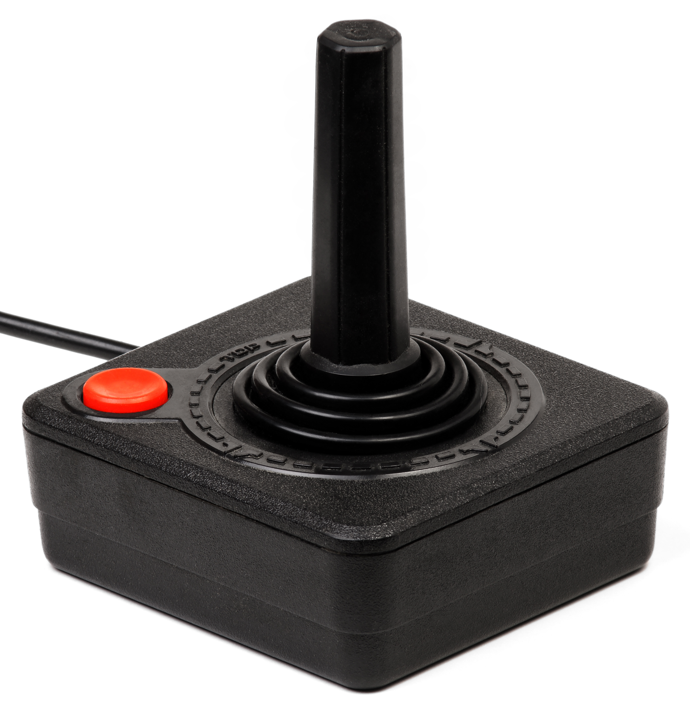

# histoire_manettes

Si vous voulez mon avis, le desing des manettes utilisées pour les consoles de jeux ont une histoire aussi intéressante que les consoles en elles-mêmes. Je pense que la meilleure manière de prouver mon point serait de commencer avec le commencement. Cette présentation va parler de l'évolution des manettes de consoles de jeux vidéos, en passant par celles que je juge importantes ou intéressantes. Cette présentation ne parlera pas de bornes d'arcades car si c'était le cas nous serions ici pour plusieurs heures, car chaque bornes d'arcades ont leurs propres controles.

## Magnavox Odyssey

Sortie originalement aux États-Unis en 1972, La Magnavox Odyssey est la première console de jeux à sortir. Elle était essentiellement une machine à jouer à Pong nommé simplement «Table Tennis» Le jeu Pong ayant été publié par Atari. Avec seulement 28 jeux disponibles, la pluparts n'étant que des variations de pong. Ce qui n'est pas surprenant si on vois la manette. N'ayant comme boutons que deux boutons rotatifs ainsi qu'un bouton reset.

À mon avis, parler de cette console peut être très intéressant, car il faut penser que c'est de ce modèle que tout les autres manettes qui sont sorties viennent, c'était le point d'origine. La Magnavox Odyssey fut la première console à être commercialisée, elle était très primitive. Mais il fallait commencer quelque part. Développée par Sanders Associates et manufacturée par Magnavox, la console s'est vendue à 350 000 unitées, ce qui est très petit, mais encore une fois, c'était la création d'un nouveau marché.

## Intellivision

Contrairement à la Magnavox Odyssey qui n'avait pas beaucoup de boutons, l'Intellivision dépasse tout les attentes, et apporte une manette avec beaucoup, beaucoup trop de boutons. L'idée de la manette était que chaque jeu venait avec morceau de carton à mettre sur la manette, le problème étant, comme les boutons faisait quelque chose de différent dans chaque jeux, sans avoir de conventions comme aujourd'hui (exemple: gachette droite= tirer dans les ou bien A ou X= avancer des dialogues) ce qui rendait impossible de jouer aux jeux sans devoir constament regarder ses mains.

L'intellivision est l'une des seules consoles ayant étée publiées par Mattel. Ayant Vendu plus ou moins 3 millions d'unitées. Aditionnellement, en plus de la manette il était possible d'utiliser un accessoire de clavier. utile pour certains jeux.

## Atari 2600

Une des consoles rétro les plus connues, et également une des consoles avec une manette commençant à avoir l'air de quelque chose qui pourrait être utilisé pour jouer à des jeux. Quelque chose qui n'est pas une boîte avec de boutons rotatifs ou un clavier de téléphone.

Le design de cette manette est iconique, avec un simple joystick et un bouton. Il manque encore une chose qui sera présent sur la majoritée des manettes plus tard. Le D-Pad, qui apparaîtera pour la première fois sur la manette de la NES.

Publiée par Atari en 1977, la console a vendue 30 Millions d'unitées, elle a été la console qui a popularisée le jeu vidéo. Pour ensuite crasher le marché après la publication de certains jeux, c'est-à=dire E-T et Pac-man Atari 2600. Ces jeux étaient extrêmement mauvais et ont ruinés la confiance des clients en la compagnie, ce qui a plus ou moins signé l'arrêt de mort de Atari en tant que compagnie majeure dans l'industrie.

## Nintendo Entertainment System

La première console publiée par l'un des producteurs encore existants aujourd'hui, sortie originalement en 1983 avec un design totalement différent, sous le nom du family computer (Famicom) Les seules différences majeures entre la version japonaise et la version globale de la console se trouvent dans les manettes. Car il n'était pas possible de les débrancher de la console, les fils étaient d'ailleurs très cours car la plupart des japonais jouaient avec la console alors qu'ils étaient assis par terre. Également, la seconde manette était équipée d'un microphone.

Maintenant, la variante globale de la manette, pour commencer, Le D-Pad, ou bien la croix. La NES fut la première console avec ce bouton, ce qui était beaucoup plus pratique qu'un joystick pour jouer aux jeux sortis sur cette console, car comme le D-Pad, il n'était seulement possible de bouger dans 4 directions. Cette manette a standarisé le design des manettes suite à elle, avec les direction sur la gauche, les boutons d'action sur la droite plus deux boutons au centre, start et select. Une convention suivie par tout les manettes sorties suite à elle, sauf une certaine manette dont on parlera plus tard.

Sortie en 1983 au Japon et en 1985 en Amérique La première console de Nintendo a reparti le marché des jeux vidéos en Amérique. Si cette console ne se serait pas bien vendue en Amérique, le monde serait probablement relativement différent. La console s'est vendue à 61 millions d'unitées globalement.

## Super Nintendo

Le successeur de la NES, avec une manette encore meilleure, elle a d'ailleurs eu un impact plus grand que ce que certains pourraient penser, je revienderai à cela à la prochaine manette. Mais la manette en elle même était l'une des manettes vue comme les meilleures. Avec une forme beaucoup plus amicale envers les mains que la dernière, et un setup de bouton devenu standart aujourd'hui avec 4 boutons sur la droite de la manette.

Sortie en 1990 au Japon et en 1991 en Amérique. La console ne s'est pas vendue aussi bien que la NES originale, mais cela ne change pas que la console était supérieur dans tout les départements.

## Playstation 1

Comme je disait plus tôt, la manette de la Snes a eu plus d'impact que ce qu'on pourrait penser, la raison pour cela était que l'extension N64 DD pour la Nintendo 64, ce qui permettait d'utiliser des disques sur la console. Qui à été développé en coopération avec Philipps, ce qui a d'ailleurs permi à cette compagnie de publier quelques jeux des franchises Nintendo sur leurs propre console, la Philipps CDI, Ces jeux sont très particuliers. Mais pour en revenir avec l'alliance entre les deux compagnies, Nintendo voulait originalement travailler avec Sony, mais ceux-ci on fini par couper le deal juste avant que le produit sois terminé, et lorsqu'ils sont partis, ils on pris le design de la manette de la Snes pour leur propre manette qui est essentiellement une manette de Snes avec des gachettes, et ont pris la technologie pour crée le lecteur DVD de la playstation.

Plus tard dans la vie de la console, Sony sortent la manette DualShock-1 et le desing de cette manette fut plus ou moins calqué pour les manettes de Ps2 à Ps4. En d'autre mots, nous ne retournerons pas beaucoup à Sony pendant cette présentation.

## Sega Dreamcast

La seule console avec une manette réelement unique venant de Sega, ironiquement, ce fut leur dernière console. Celle-ci avait une idée unique pour l'époque ou elle est sortie. Car elle avait un écran dans la manette, celle-ci était détacheable et agissait comme une petite console portable.

Sortie en 1998 au Japon et 1999 globalement, la Dreamcast fut l'une des consoles avec le moins de ventes ayant sortie après le crash du marché. Ne s'ayant seulement vendue à 9.13 millions d'unitées, ce qui est pitoyable quand on prend en compte les autres consoles de la compagnie.

